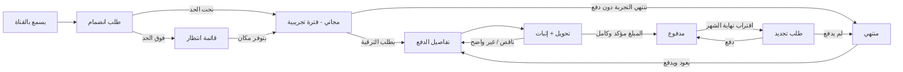
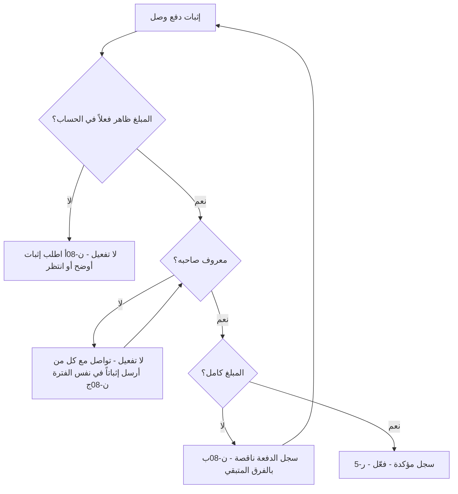

# رحلات الـMVP

كل رحلة مكتوبة بنفس البنية:

- **البداية**: ما الذي يطلق الرحلة.
- **الخطوات**: من يفعل ماذا، وأين (القناة / محادثة خاصة / الجدول).
- **التسجيل**: ما الذي يتغير في الجداول.
- **الاستثناءات**: الحالات من القسم 7 في المواصفات التي تقع داخل هذه الرحلة.
- **منتهية حين**: معيار القبول من القسم 10.

الرسائل المشار إليها بـ`[ن-xx]` موجودة نصاً في [`messages.md`](messages.md).
الجداول المشار إليها موجودة في [`templates/`](templates/).

---

## الخريطة العامة

### حالات المشترك (عمود `الحالة` في جدول المشتركين)

| الحالة | المعنى | في القناة؟ |
|---|---|---|
| `انتظار` | طلب الانضمام وصل والحد المجاني ممتلئ | لا |
| `مجاني` | داخل الفترة التجريبية | نعم |
| `مدفوع` | دفعة مؤكدة وكاملة تغطي الفترة الحالية | نعم |
| `منتهي` | انتهت التجربة أو الاشتراك دون تجديد، أو غادر | لا |

قاعدة واحدة تحكم كل الانتقالات: **لا ينتقل أحد إلى `مدفوع` إلا بعد أن يرى المدير المبلغ الكامل في حسابه فعلياً.**
إثبات الدفع (صورة/إيصال) وحده لا يكفي.

---

# أولاً: رحلات المشترك

## ر-1 · الانضمام للقناة مجاناً

**البداية**: شخص يصل لرابط الدعوة (من إعلان، صديق، منشور).

| # | من | أين | الخطوة |
|---|---|---|---|
| 1 | الشخص | تيليغرام | يضغط رابط الدعوة ← "طلب الانضمام" |
| 2 | المدير | تيليغرام ← طلبات الانضمام | يرى الطلب (مرة يومياً على الأقل، انظر [الروتين](routine.md)) |
| 3 | المدير | الجدول ← المشتركون | يعدّ المشتركين بحالة `مجاني` |
| 4أ | المدير | تيليغرام | **تحت `{الحد_الأقصى_المجاني}`**: يقبل الطلب |
| 4ب | المدير | محادثة خاصة | **الحد ممتلئ**: لا يقبل الطلب، يرسل [ن-02] ويسجله `انتظار` |
| 5 | المدير | محادثة خاصة | يرسل رسالة الترحيب [ن-01] (تتضمن مدة التجربة، أن التوصيات ليست ضماناً، وطريقة التواصل) |
| 6 | الشخص | القناة | يبدأ باستقبال التوصيات مع البقية |

**التسجيل** (المشتركون): صف جديد — الاسم، معرّف تيليغرام، الحالة `مجاني`، تاريخ الانضمام = اليوم،
نهاية التجربة = تاريخ الانضمام + `{مدة_التجربة}`.

**الاستثناءات**
- *الأعضاء المجانيون تجاوزوا الحد* ← قائمة انتظار (4ب). عند خروج أي عضو مجاني أو انتهاء تجربته، المدير يأخذ
  **أقدم** شخص في الانتظار، يرسل له رابطاً/يقبل طلبه، ويحوّل حالته إلى `مجاني` بتاريخ انضمام جديد.

**منتهية حين**: الشخص طلب، المدير قبله، والشخص يرى منشورات القناة.

---

## ر-2 · الفترة التجريبية: استقبال التوصيات والنتائج

**البداية**: قبول العضو في ر-1.

| # | من | أين | الخطوة |
|---|---|---|---|
| 1 | المشترك | القناة | يستقبل كل توصية تُنشر (رحلة المدير م-5) |
| 2 | المشترك | القناة | يستقبل نتيجة كل توصية عند تقييمها، وملخص الأداء الدوري (م-8، م-9) |
| 3 | المشترك | القناة | ينفذ الصفقات بنفسه على منصته — لا ربط ولا تنفيذ من جهتنا |
| 4 | المدير | محادثة خاصة | قبل نهاية التجربة بـ3 أيام: يرسل تذكير [ن-03] مع ملخص أداء فترة تجربته |
| 5 | المدير | محادثة خاصة | يوم نهاية التجربة: إن لم يطلب الترقية ← رحلة م-10 (إنهاء) |

**منتهية حين**: المشترك استقبل كل توصية ونتيجة نُشرت خلال فترته، ووصله تذكير نهاية التجربة.

> **قرار مفتوح**: فترة سماح بعد نهاية التجربة/الاشتراك قبل الإزالة من القناة؟ الرحلات الحالية تفترض
> **لا سماح** (إزالة في نفس اليوم) حتى تقرر غير ذلك.

---

## ر-3 · الترقية إلى اشتراك مدفوع

**البداية**: المشترك المجاني يقرر الاستمرار (من نفسه، أو رداً على [ن-03]).

| # | من | أين | الخطوة |
|---|---|---|---|
| 1 | المشترك | محادثة خاصة مع المدير | يرسل رغبته بالاشتراك (أي صيغة: "أبغى أشترك") |
| 2 | المدير | الجدول ← المشتركون | يسجل `تاريخ طلب الترقية` |
| 3 | المدير | محادثة خاصة | ينتقل مباشرة لرحلة **ر-4** (يرسل تفاصيل الدفع) |

**منتهية حين**: المشترك أرسل طلبه، ووصلته تفاصيل الدفع.

---

## ر-4 · الدفع وإرسال الإثبات

**البداية**: طلب ترقية (ر-3) أو طلب تجديد (ر-6).

| # | من | أين | الخطوة |
|---|---|---|---|
| 1 | المدير | محادثة خاصة | يرسل [ن-04]: المبلغ، الوسيلة، بيانات الحساب، **رمز المرجع** للمشترك |
| 2 | المشترك | تطبيق البنك/المحفظة | يحوّل المبلغ ويضع رمز المرجع في خانة الملاحظات إن أمكن |
| 3 | المشترك | محادثة خاصة | يرسل إثبات الدفع (صورة إيصال / رقم عملية / hash للتحويل) |
| 4 | المدير | — | ينتقل لرحلة المدير **م-3** (التحقق والتسجيل) |

**رمز المرجع**: `معرّف المشترك` من الجدول (مثل `S-0042`). يسهّل مطابقة الدفعة بصاحبها ويقلل حالة "دفعة بلا صاحب".

**منتهية حين**: المشترك استلم المبلغ والوسيلة كاملين (معيار "طلب الدفع من المشترك").

---

## ر-5 · تأكيد التفعيل

**البداية**: المدير أنهى التحقق في م-3 بنتيجة "مؤكد وكامل".

| # | من | أين | الخطوة |
|---|---|---|---|
| 1 | المدير | محادثة خاصة | يرسل [ن-05]: اشتراكك فعّال من `{تاريخ}` إلى `{تاريخ}` |
| 2 | المشترك | القناة | يبقى في القناة ويستمر كالمعتاد — لا يتغير شيء في تجربته |

**منتهية حين**: الحالة `مدفوع`، الدفعة مسجلة باسمه وتاريخها، ووصلته رسالة التفعيل.

---

## ر-6 · التجديد الشهري

**البداية**: قبل `نهاية الاشتراك` بـ3 أيام (يلتقطها المدير من الجدول في الروتين اليومي).

| # | من | أين | الخطوة |
|---|---|---|---|
| 1 | المدير | محادثة خاصة | يرسل [ن-06] (تذكير + ملخص أداء الشهر + تفاصيل الدفع) |
| 2أ | المشترك | — | يريد الاستمرار ← يدفع ويرسل الإثبات ← م-3 ← [ن-05] بفترة جديدة تبدأ من **نهاية الفترة السابقة** (لا من يوم الدفع) |
| 2ب | المشترك | — | لا يرد أو يرفض ← يوم نهاية الاشتراك: رحلة م-10 (إنهاء) |

لا يوجد تجديد تلقائي — كل شهر يُكرر الدفع يدوياً.

**منتهية حين**: إما دفعة جديدة مؤكدة ونهاية اشتراك جديدة في الجدول، أو الحالة `منتهي`.

---

## ر-7 · الاستفسار أو الشكوى

**البداية**: المشترك يرسل رسالة خاصة للمدير.

| # | من | أين | الخطوة |
|---|---|---|---|
| 1 | المشترك | محادثة خاصة | يرسل استفساره أو شكواه |
| 2 | المدير | محادثة خاصة | يرد مباشرة، خلال 24 ساعة كحد أقصى |
| 3 | المدير | — | إن احتاج الرد وقتاً: يرسل [ن-07] (استلمنا، سنرد خلال …) ثم يرد |

**قواعد**
- لا تُناقش بيانات دفع أو تواصل أي مشترك آخر.
- لا توصيات خاصة لمشترك بعينه — كل توصية تُنشر للجميع في القناة (خارج النطاق: التخصيص).
- شكوى من الخسائر ← الرد يشير لإخلاء المسؤولية ولسجل النتائج المعلن.

> **قرار مفتوح**: سياسة الاسترداد لمشترك غاضب من الخسائر. حتى تقرر: المدير لا يعد بأي استرداد ويرد بـ[ن-07ب].

**منتهية حين**: كل رسالة وصلت من مشترك لها رد من المدير (لا محادثة غير مقروءة/غير مردود عليها نهاية اليوم).

---

# ثانياً: رحلات المدير

## م-1 · قبول الانضمام وإدارة قائمة الانتظار

هي الجانب الإداري من ر-1. خلاصتها في الروتين اليومي:

1. افتح طلبات الانضمام في القناة.
2. لكل طلب: عدد `مجاني` < `{الحد_الأقصى_المجاني}` ← اقبل + [ن-01] + صف في الجدول. وإلا ← [ن-02] + صف بحالة `انتظار`.
3. إن فرغ مكان: أقدم `انتظار` ← اقبل + [ن-01] + غيّر حالته إلى `مجاني` وحدّث تاريخ الانضمام.

---

## م-2 · طلب الدفع

هي الجانب الإداري من ر-4 (خطوة 1). قبل الإطلاق يُحدَّد `{المبلغ}` و`{وسيلة_الدفع}` مرة واحدة ولا تُرسل رسالة
[ن-04] ناقصة أي منهما.

---

## م-3 · التحقق من الدفعة وتسجيلها

**البداية**: وصل إثبات دفع من مشترك، أو وصل مبلغ إلى الحساب.

| # | الخطوة | التسجيل |
|---|---|---|
| 1 | افتح تطبيق البنك/المحفظة وتأكد أن المبلغ **وصل فعلاً** (لا تعتمد على صورة الإيصال) | — |
| 2 | طابق الدفعة بصاحبها (رمز المرجع، اسم المحوّل، التوقيت) | — |
| 3 | سجل الدفعة | صف في `الدفعات`: معرّف المشترك، المبلغ، تاريخ الإرسال، الوسيلة، `مؤكدة` = نعم/لا، `مكتملة` = نعم/لا |
| 4 | إن اكتمل المبلغ (قد يكون مجموع أكثر من دفعة ناقصة) | `المشتركون`: الحالة `مدفوع`، بداية ونهاية الاشتراك |
| 5 | أرسل [ن-05] | — |

**الاستثناءات**
| الحالة | السلوك |
|---|---|
| يقول دفع ولا إثبات واضح / المبلغ غير ظاهر | لا تفعيل. [ن-08أ]. الحالة تبقى كما هي |
| المبلغ أقل من المطلوب | تُسجل الدفعة `مكتملة = لا`. [ن-08ب] بالفرق. لا تفعيل حتى يصل الفرق، ثم تُسجل الدفعة الثانية ويُفعَّل |
| دفعة بلا صاحب واضح | تُسجل بمعرّف مشترك `مجهول`. تواصل مع **كل** من أرسل إثباتاً في نفس الفترة [ن-08ج]. لا تفعيل لأحد حتى تتأكد، ثم عدّل معرّف المشترك في الصف |

**منتهية حين**: كل مبلغ مؤكد الوصول مسجل باسم صاحبه وتاريخه، واشتراكه مفعّل، ووصلته رسالة التفعيل.

---

## م-4 · تحليل السوق وصياغة التوصية

**البداية**: جلسة التحليل في الروتين اليومي، أو خبر مؤثر مفاجئ.

| # | الخطوة |
|---|---|
| 1 | راجع أسعار العملات النشطة في `العملات المراقبة` (20 عملة) |
| 2 | راجع الأخبار المؤثرة في مصدر الأخبار |
| 3 | قرر: هل توجد فرصة شراء أو بيع واضحة؟ إن لا ← لا توصية اليوم (لا بأس) |
| 4 | إن نعم: اكتب مسودة التوصية بقالب [ن-10] — العملة، النوع، السعر وقت الصياغة، السبب، موعد التقييم |
| 5 | خذ الرقم التالي من `التوصيات` (مثل `R-0017`) وضعه في المسودة |

**قاعدة**: لا تُكتب توصية على عملة غير موجودة كـ`نشطة` في `العملات المراقبة`.

**منتهية حين**: المسودة تحتوي العملة، النوع، السبب، والسعر، وموعد التقييم.

---

## م-5 · نشر التوصية

**البداية**: مسودة جاهزة من م-4.

| # | الخطوة | التسجيل |
|---|---|---|
| 1 | **افتح السعر الحالي لحظة النشر** وقارنه بسعر الصياغة | — |
| 2أ | ما زالت منطقية ← حدّث السعر في المسودة إلى سعر لحظة النشر | — |
| 2ب | تغير السعر وأبطلها ← عدّلها أو ألغها **قبل** النشر (لا تُنشر) | صف في `التوصيات` بحالة `أُلغيت قبل النشر` (اختياري، للمراجعة الذاتية) |
| 3 | انشر في القناة (رسالة واحدة، كل المشتركين يستقبلونها معاً) | — |
| 4 | **فوراً** أرشف: صف في `التوصيات` + رابط الرسالة في القناة | الرقم، العملة، النوع، السبب، تاريخ ووقت النشر، السعر وقت النشر، موعد التقييم، رابط الرسالة، الحالة `منشورة` |

**منتهية حين**: التوصية وصلت للقناة، ولها صف في `التوصيات` برابط الرسالة.

---

## م-6 · تصحيح توصية منشورة

**البداية**: اكتشاف خطأ في توصية منشورة (اسم العملة، النوع، السعر…).

| # | الخطوة | التسجيل |
|---|---|---|
| 1 | **لا تحذف** الرسالة الأصلية ولا تعدّل نصها | — |
| 2 | انشر فوراً [ن-11] كـ**رد (Reply)** على الرسالة الأصلية: ما الخطأ وما الصحيح | — |
| 3 | حدّث صف التوصية | `عُدّلت` = نعم، `ملاحظة التعديل` = نص التصحيح + رابطه |

إلغاء توصية بعد نشرها (الفرصة لم تعد قائمة) يتبع نفس الخطوات بقالب [ن-12]، و`أُلغيت` = نعم. التوصية الملغاة
بعد النشر **تبقى** في الأرشيف وتدخل الملخص كـ"ملغاة".

---

## م-7 · مراجعة الأرشفة اليومية

**البداية**: الروتين اليومي (نهاية اليوم).

1. مرّر في القناة على منشورات آخر 24 ساعة.
2. كل توصية منشورة يجب أن يقابلها صف في `التوصيات` برابطها. إن نُسيت واحدة ← أضف صفها الآن بتاريخ ووقت النشر
   الفعلي من القناة وسعرها وقتها (من الشارت التاريخي).

**منتهية حين**: عدد التوصيات في القناة = عدد الصفوف `منشورة/ملغاة` في `التوصيات` لنفس الفترة.

---

## م-8 · تسجيل نتيجة التوصية

**البداية**: توصية وصلت `موعد التقييم` (يلتقطها المدير بفرز `التوصيات` حسب موعد التقييم في الروتين اليومي).

| # | الخطوة | التسجيل |
|---|---|---|
| 1 | افتح سعر العملة عند موعد التقييم | — |
| 2 | احسب التغير: شراء ← (سعر التقييم − سعر النشر) ÷ سعر النشر. بيع ← العكس | — |
| 3 | الحكم: التغير لصالح التوصية وأكبر من `{عتبة_التعادل}` ← `ربح`. ضدها وأكبر من العتبة ← `خسارة`. غير ذلك ← `غير محسوم` | صف في `النتائج`: رقم التوصية، سعر التقييم، نسبة التغير، الحكم، تاريخ التسجيل |
| 4 | انشر النتيجة في القناة [ن-13] كرد على رسالة التوصية الأصلية | — |

**قواعد**
- لا تُجبر نتيجة غامضة على ربح أو خسارة — `غير محسوم` تصنيف مشروع.
- النتيجة تُسجل في موعدها، لا يُمدد الموعد لأن السعر "قد يرتد".
- توصية ملغاة بعد النشر ← حكمها `ملغاة` ولا تُقيَّم.

**منتهية حين**: كل توصية تجاوز موعد تقييمها لها صف في `النتائج`.

---

## م-9 · ملخص الأداء الدوري

**البداية**: كل `{دورية_الملخص}` (في الروتين الأسبوعي).

| # | الخطوة |
|---|---|
| 1 | صفّ `النتائج` على الفترة |
| 2 | عدّ يدوياً: إجمالي التوصيات، ربح، خسارة، غير محسوم، ملغاة، لم يحن تقييمها |
| 3 | اكتب الملخص بقالب [ن-14] — **كل** توصية في الفترة بسطر (رقمها، العملة، النوع، الحكم، النسبة) |
| 4 | انشره في القناة وثبّته (Pin) |

**قواعد**
- المجموع في الملخص يجب أن يساوي عدد الصفوف في الفترة — لا استثناء لأي توصية.
- فترة خسائر متتالية ← يُنشر الملخص في موعده كما هو، دون تأجيل أو إخفاء.

**منتهية حين**: الملخص منشور في موعده ويشمل كل توصيات الفترة رابحها وخاسرها.

---

## م-10 · تحديث قائمة المشتركين وإنهاء الاشتراكات

**البداية**: الروتين اليومي.

| # | الخطوة | التسجيل |
|---|---|---|
| 1 | فرز `المشتركون` حسب `نهاية التجربة` و`نهاية الاشتراك` | — |
| 2 | من تبقى له 3 أيام ← [ن-03] (مجاني) أو [ن-06] (مدفوع) | `تاريخ آخر تذكير` |
| 3 | من انتهت فترته اليوم ولم يدفع ← أزِله من القناة + [ن-09] | الحالة `منتهي`، `تاريخ المغادرة` = اليوم |
| 4 | من غادر القناة من نفسه ← | الحالة `منتهي`، `تاريخ المغادرة` |
| 5 | فرغ مكان مجاني ← م-1 خطوة 3 (قائمة الانتظار) | — |
| 6 | عضو `منتهي` يعود ويدفع ← ر-4 ← عند التأكيد يُعاد للقناة، الحالة `مدفوع` | لا تنشئ صفاً جديداً — نفس المعرّف |

**منتهية حين**: عدد `مجاني` + `مدفوع` في الجدول = عدد أعضاء القناة (عدا المدير).

---

## م-11 · الرد على الاستفسارات

الجانب الإداري من ر-7: مراجعة المحادثات الخاصة مرتين يومياً، ولا تنتهي الجلسة ومحادثة بلا رد.

---

# ثالثاً: الرحلة الأساسية كاملة (مثال)

| اليوم | ماذا يحدث | الرحلة |
|---|---|---|
| 1 | أحمد يطلب الانضمام، المدير يقبله ويرحب به، يُسجل `S-0042 · مجاني` | ر-1 / م-1 |
| 1–14 | أحمد يستقبل التوصيات R-0010…R-0021 ونتائجها وملخصين أسبوعيين (فيهما خسارتان معلنتان) | ر-2 / م-4…م-9 |
| 11 | يصله تذكير نهاية التجربة مع ملخص فترته | م-10 |
| 12 | يرسل "أبغى أشترك"، يصله المبلغ ووسيلة الدفع ورمز `S-0042` | ر-3 / ر-4 |
| 12 | يحوّل **أقل** من المطلوب ويرسل الإيصال | ر-4 |
| 12 | المدير يرى المبلغ في الحساب، يسجله `مكتملة = لا`، ويرسل الفرق | م-3 |
| 13 | يحوّل الفرق، المدير يتأكد، يسجل الدفعة الثانية، الحالة `مدفوع` حتى يوم 43 | م-3 |
| 13 | يصله "اشتراكك فعّال من 13 إلى 43" | ر-5 |
| 40 | يصله تذكير التجديد | ر-6 |
| 42 | يدفع، يُمدد حتى يوم 73 (من نهاية الفترة السابقة) | ر-6 / م-3 |
